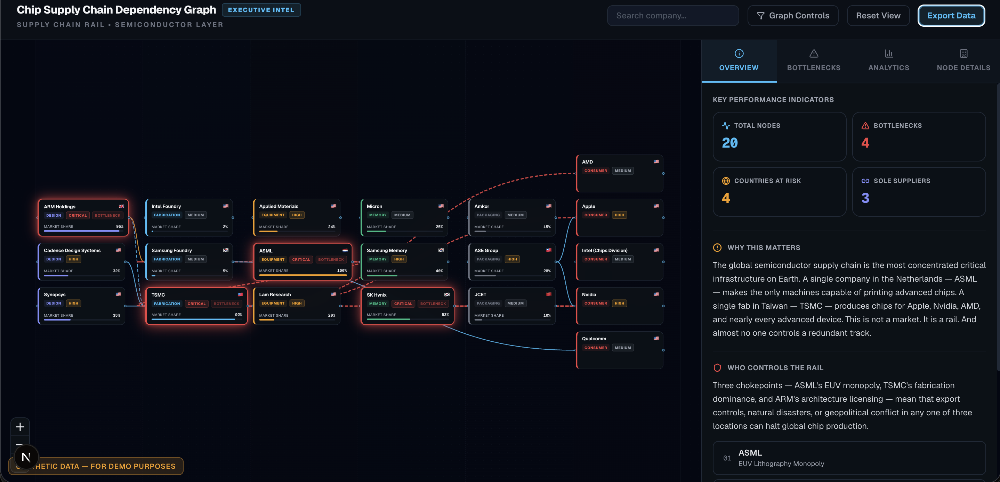
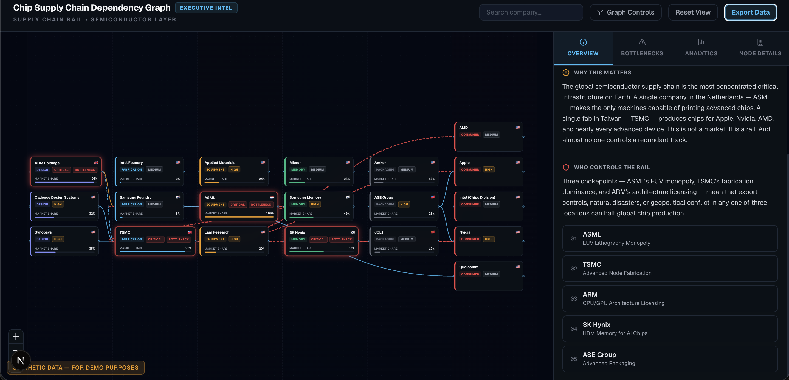
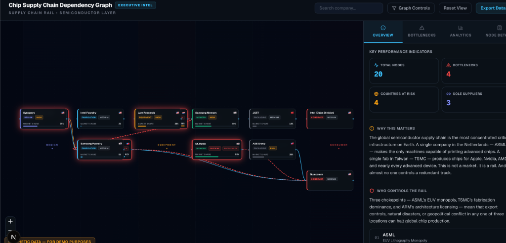
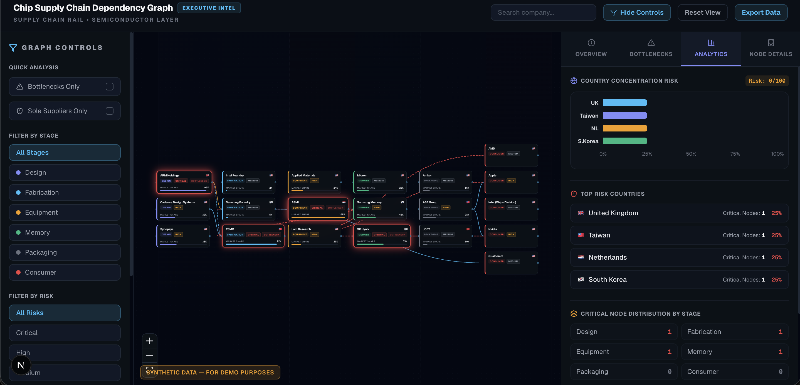

# Real Rails PoC #93 — Chip Supply Chain Dependency Graph

An executive intelligence platform for visualizing critical dependencies, bottlenecks, and concentration risks across the global semiconductor manufacturing supply chain. 

This repository implements a premium, high-density 3-panel dashboard designed to fit all critical companies and relations on a single screen, eliminating the need for excessive panning or zooming.

---

## 🛠 Technology Stack

### Backend
* **FastAPI**: High-performance Python API framework.
* **NetworkX**: Graph theory network analysis library used to compute bottleneck scores, paths, and country concentration.
* **Pydantic**: Data validation and serialization contracts.
* **Uvicorn**: ASGI web server implementation.

### Frontend
* **Next.js (v16 App Router & Turbopack)**: Fast React framework.
* **React Flow (`@xyflow/react`)**: Interactive node-graph rendering engine.
* **Recharts**: Responsive SVG charting library for rendering country concentration.
* **Vanilla CSS / TailwindCSS**: Modern styling, custom glassmorphism, and animations (critical edge flows, bottleneck pulses).
* **Lucide React**: Clean vector iconography.

---

## 📐 Directory Structure

```
poc 2/
├── backend/
│   ├── main.py            # FastAPI main entry point & routing
│   ├── graph_engine.py    # NetworkX-based analysis & calculations
│   ├── mock_data.py       # Pre-seeded 21 nodes & 13+ edges dataset
│   ├── schemas.py         # Pydantic schema declarations
│   └── requirements.txt   # Python dependency declarations
├── frontend/
│   ├── src/
│   │   ├── app/
│   │   │   ├── page.tsx       # Main dashboard layout & filtering state
│   │   │   ├── globals.css    # Animations, colors, and global CSS tokens
│   │   │   └── layout.tsx     # Next.js root layout & fonts
│   │   ├── components/
│   │   │   ├── graph/
│   │   │   │   ├── DependencyGraph.tsx   # React Flow canvas wrapper
│   │   │   │   ├── StageNode.tsx         # Custom company profile node cards
│   │   │   │   ├── CustomEdge.tsx        # Highlighting dependency-type paths
│   │   │   │   └── layout.ts             # Deterministic column centering algorithm
│   │   │   ├── sidebar/
│   │   │   │   ├── Filters.tsx             # Collapsible Left Panel filters
│   │   │   │   ├── IntelligenceSidebar.tsx # Right Panel router
│   │   │   │   ├── OverviewTab.tsx         # KPI metrics & summaries
│   │   │   │   ├── BottlenecksTab.tsx      # Risk-sorted chokepoint list
│   │   │   │   └── AnalyticsTab.tsx        # Country concentration analytics
│   │   └── lib/
│   │       ├── api.ts            # Client-side fetch utilities
│   │       └── types.ts          # TypeScript shared interface definitions
│   └── package.json       # Node dependency declarations
└── README.md              # Master project documentation
```

---

## ⚙️ How the Layout Engine Works

To fulfill executive dashboard standards, the application bypasses random force-directed or unconstrained layouts in favor of a **deterministic vertical-centering stage-column layout** written in [layout.ts](file:///Users/sangeethps/poc%202/frontend/src/components/graph/layout.ts):

1. **Stage Columns Assignment**: Every node is assigned to one of six sequential columns representing stages in the chip manufacturing rail:
   $$\text{Design} \rightarrow \text{Fabrication} \rightarrow \text{Equipment} \rightarrow \text{Memory} \rightarrow \text{Packaging} \rightarrow \text{Consumer}$$
2. **Horizontal Alignment**: Columns are spaced precisely at `x = stageIndex * 270 + 50` pixels, which centers each $220\text{px}$ node card perfectly within its corresponding $270\text{px}$ background swimlane.
3. **Vertical Centering & Bounded Heights**: Within each column, nodes are sorted and spaced vertically:
   $$y_i = \text{startY} + i \times (\text{NodeHeight} + \text{gap})$$
   Where $\text{startY}$ centers the active set inside a bounded height of $620\text{px}$. This guarantees **zero vertical overflow** and ensures all nodes fit comfortably on the screen upon loading.

---

## ⚡️ Key Features & Filtering Rules

### 1. Dynamic Client-Side Filtering
Filtering is done at the dataset level in [page.tsx](file:///Users/sangeethps/poc%202/frontend/src/app/page.tsx). Activating filters (Risk Levels, Stages, Countries, Bottlenecks, or Sole Suppliers) immediately updates the underlying graph data:
* **Edge Filtering**: No orphaned edges. Edges are only rendered when **both** source and target nodes are visible.
* **Auto-Scaling**: When the filtered node set updates, the graph automatically centers the remaining items and calls `fitView()` to rescale the canvas cleanly.

### 2. Interactive Highlights
* **Dependency Chain Traversal**: Hovering over any node dynamically highlights its entire upstream and downstream paths (who it depends on and who it supplies) while dimming unrelated nodes to `0.15` opacity.
* **Bottleneck Pulse**: Chokepoint nodes feature an animated border-glow representing supply chain risk.

### 3. Dynamic Sidebar Metrics & Analytics
All figures in the Right Tabbed Sidebar adjust on-the-fly when filters change:
* **KPI Metrics**: Total visible nodes, bottleneck count, countries at risk, and sole-supplier counts recalculate immediately.
* **Country Concentration Risk Score**: Computes a normalized **Herfindahl-like index (HHI)** based on the distribution of visible bottlenecks by country. 

### 4. Interactive Search & State Reset
* **Company Search**: Quick auto-complete search bar in the top header. Selecting a company zooms the graph directly onto its node card.
* **Reset View Button**: A dedicated button that clears selected nodes, resets all filter states, empties the search query, and restores the initial default zoom and center.

---

## 🚀 Setup & Running Instructions

Open two terminal tabs to run both services:

### Step 1: Start Backend (FastAPI)
```bash
cd backend
# Create Python virtual environment
python3 -m venv venv
# Activate virtual environment
source venv/bin/activate
# Install backend dependencies
pip install -r requirements.txt
# Start FastAPI application
python main.py
```
*The API runs on [http://localhost:8000](http://localhost:8000).*

### Step 2: Start Frontend (Next.js)
```bash
cd frontend
# Install node dependencies
npm install
# Start Next.js development server
npm run dev
```
*The web dashboard runs on [http://localhost:3000](http://localhost:3000).*

---

## 📸 Screenshots

Here are the visual layouts and interface features of the executive intelligence dashboard:

### 1. Initial Load (Full Viewport Center Layout)
All 21 nodes across 6 stages are immediately visible, balanced, and readable.


### 2. Graph Controls (Collapsible Filters Panel)
The left panel transitions smoothly and houses multi-select filters, chokepoint filters, and reset controls.


### 3. Interactive Hover Pathways
Hovering over a company (e.g. ASML) highlights its direct upstream and downstream dependencies and dims other parts.


### 4. Dynamic Filter Recalculation
Filtering for a specific subset (e.g. Critical Risk or Taiwan only) updates all graph coordinates, dynamically centers the visible nodes, and updates metrics.


---

## 🚀 Deployment

### Backend — Railway

1. Go to [railway.app](https://railway.app) → **New Project** → Deploy from GitHub repo
2. Select this repository
3. Set root directory to: `backend`
4. Add environment variables:
   ```
   SAM_API_KEY=your_key
   CORS_ORIGINS=https://your-vercel-app.vercel.app
   ```
5. Go to **Settings → Networking → Generate Domain**
6. Copy your Railway backend URL

### Frontend — Vercel

1. Go to [vercel.com](https://vercel.com) → **New Project** → Import from GitHub
2. Select this repository
3. Set root directory to: `frontend`
4. Add environment variable:
   ```
   NEXT_PUBLIC_API_URL=https://your-backend.railway.app
   ```
5. Click **Deploy**

### After deployment

Update Railway `CORS_ORIGINS` to your actual Vercel frontend URL.

### Backend + Frontend — Render

**Option A: Blueprint (one-click)**

1. Go to [render.com](https://render.com) → **New** → **Blueprint**
2. Connect this repository
3. Render reads [`render.yaml`](render.yaml) and creates both services
4. Enter your `SAM_API_KEY` when prompted
5. After deploy, update `CORS_ORIGINS` on the backend service to your actual frontend URL
6. Update `NEXT_PUBLIC_API_URL` on the frontend service to your actual backend URL

**Option B: Manual setup**

1. **Backend** — New → Web Service
   - Root directory: `backend`
   - Runtime: **Python 3**
   - Build command: `pip install -r requirements.txt`
   - Start command: `uvicorn main:app --host 0.0.0.0 --port $PORT`
   - Add env vars: `SAM_API_KEY`, `CORS_ORIGINS`
2. **Frontend** — New → Web Service
   - Root directory: `frontend`
   - Runtime: **Node**
   - Build command: `npm install && npm run build`
   - Start command: `npm start`
   - Add env var: `NEXT_PUBLIC_API_URL=https://your-backend.onrender.com`

---

## 🐳 Docker (Local)

1. Copy env file:
   ```bash
   cp .env.example .env
   ```

2. Add your SAM API key to `.env`

3. Build and start:
   ```bash
   docker-compose up --build
   ```

4. Open [http://localhost:3000](http://localhost:3000)

5. Stop:
   ```bash
   docker-compose down
   ```
